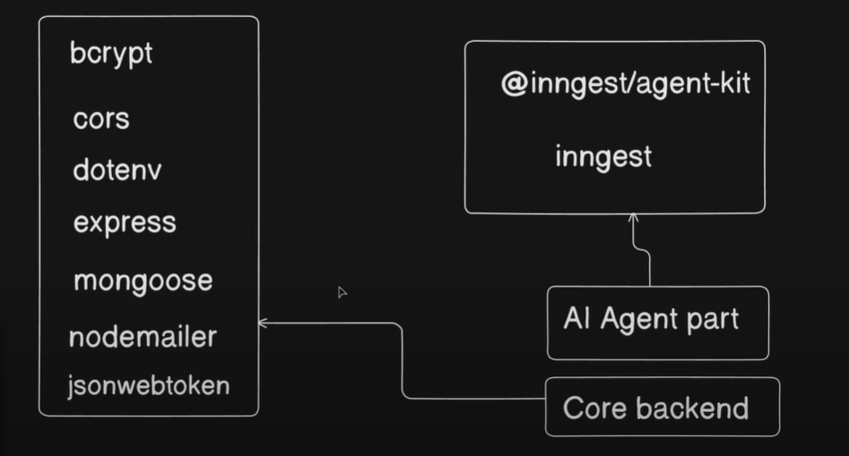

### Project Tech Stack

- bcrypt : hashing the password
- cors : for not getting the cors error in front-end 
- dotenv : To load the environment variable
- express : Routing Library
- mongoose : ORM for MongoDB
- nodemailer : Mail sending lib
- jsonwebtoken : 